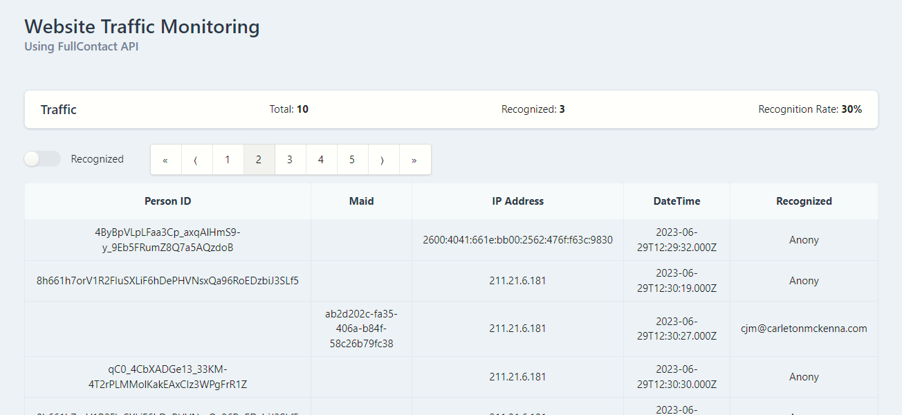

# Anonymous Visitor Recognition System (POC)

This system is designed to recognize anonymous visitors on your website. We leverage the FullContact customer recognition tag, which enables us to assign a unique FullContact Person ID to each visitor, stored in the browser's cookie. 

Our backend, built on Next.js, maintains a customer contact list in MongoDB, associating each contact with their respective Person ID. 

When a new Person ID is captured from a cookie, the backend queries the MongoDB database to match the ID with the corresponding visitor, thus, identifying the visitor.

## How it works

## Features

- **FullContact Integration:** This allows us to effectively assign a unique identification to each visitor. 
- **Next.js Backend:** Efficient, server-side rendering with JavaScript and Next.js.
- **MongoDB Database:** Our customer contact list is securely stored in a MongoDB database. Each contact is associated with a unique FullContact Person ID.
- **Maid Recognition Feature (Under Development):** A new feature we are planning to add, to increase the match rate of our system.

## Getting Started

These instructions will get you a copy of the project up and running on your local machine for development and testing purposes.

### Prerequisites

- Node.js
- MongoDB
- FullContact account

### Installation

1. Embed FullContact Customer Recognition Tag to your website and cystomize your website code to push person id to the server.
2. Clone this repo to your local machine using `https://github.com/TargetIQ/Tracking.git`
3. Install the dependencies with `npm install` and Update the `.env` file with your FullContact API key and MongoDB connection string.
4. Build and Run the server with `npm run build` & `npm run start`.

## License

Distributed under the MIT License. See `LICENSE` for more information.

Project Link: [https://github.com/TargetIQ/Tracking](https://github.com/TargetIQ/Tracking)

## [See Live] (http://147.182.133.115:3000/)

